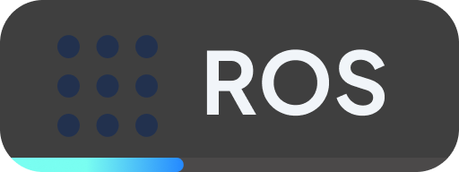
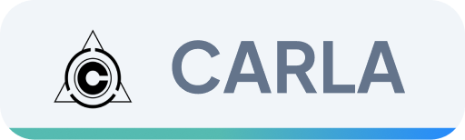
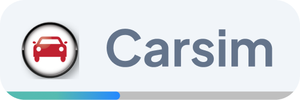
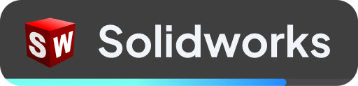
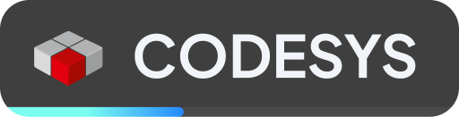
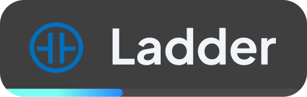
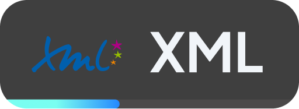
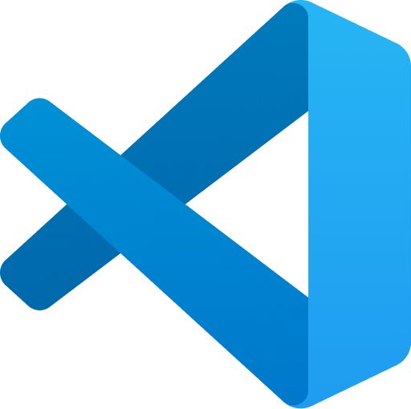
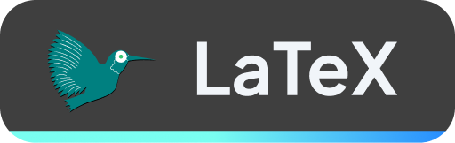

# Hello, I'm Lorenzo!

### Mechatronic Engineer | Working with Control systems, Robotics, Simulation and Autonomous vehicles

---

### 🧑🏻‍💻 About Me

Mechatronics engineer with a solid mechanical background, keen on Control Systems, Robotics, Simulation and Autonomous vehicles

- 🔭 Currently working as an **ADAS Performance Feature Designer** at Stellantis for Teoresi Group
- 🔍 Previously **Advanced Vehicle Dynamics Intern** at Danisi Engineering, **Research & Development Intern** at Thales Alenia Space
- 🎓 MSc in Mechatronic Engineering (Technologies for eMobility)
- 🎓 BSc in Mechanical Engineering
- ⚡ Passionate about computer science and innovative design

---

### ⚙️ Projects

- [Sizing of a power conversion system for xEV](https://github.com/lorenzovadacca/Sizing-of-a-power-conversion-system-for-xEV.git) : MATLAB/Simulink simulation and control of an electric vehicle powertrain, integrating a bidirectional DC/DC boost converter and an IPM motor drive with FOC, MTPA and field-weakening strategies.

---

### 🛠️ Skills

#### Control systems & model-based design

  
  &nbsp;
  

#### Autonomous vehicles, simulation & robotics

  
  &nbsp;
  
  &nbsp;
  
  &nbsp;
  
  &nbsp;
  

#### Mechanical design

  
  &nbsp;
  
  &nbsp;
  

#### Industrial automation

  
  &nbsp;
  
  &nbsp;
  
  &nbsp;
  

#### Programming languages & development tools

  
  &nbsp;
  
  &nbsp;
  
  &nbsp;
  
  &nbsp;
  

