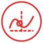

# Hello, I'm Lorenzo!

### Mechatronic Engineer | Working with Control systems, Robotics, Simulation and Autonomous vehicles

---

### 🧑🏻‍💻 About Me

Mechatronics engineer with a solid mechanical background, keen on Control Systems, Robotics, Simulation and Autonomous vehicles.

- 🔭 Currently working as an **ADAS Performance Feature Designer** at Stellantis for Teoresi Group.
- 🔍 Previously **Advanced Vehicle Dynamics Intern** at Danisi Engineering, **Research & Development Intern** at Thales Alenia Space.
- 🎓 MSc in Mechatronic Engineering (Technologies for eMobility).
- 🎓 BSc in Mechanical Engineering.
- ⚡ Passionate about computer science and innovative design.

---

### ⚙️ Projects

- Project 1: Description Project 1.
- Project 2: Description Project 2.
- Project 3: Description Project 3.
- Project 4: Description Project 4.
- Project 5: Description Project 5.

---

### 🛠️ Skills

#### Control systems & model-based design

<table>
  <tr>
    <td align="left" valign="top"> MATLAB</td>
    <td align="left" valign="top"> Simulink</td>
  </tr>
</table>

#### Autonomous vehicles, simulation & robotics

<table>
  <tr>
    <td align="left" valign="top"> ROS 2</td>
    <td align="left" valign="top"> CARLA Simulator</td>
    <td align="left" valign="top"> VI-CarRealTime</td>
    <td align="left" valign="top"> IPG CarMaker</td>
    <td align="left" valign="top"> CarSim</td>
  </tr>
</table>

#### Mechanical design

<table>
  <tr>
    <td align="left" valign="top"> SolidWorks</td>
    <td align="left" valign="top"> Autodesk Fusion</td>
    <td align="left" valign="top"> Altair HyperMesh</td>
  </tr>
</table>

#### Industrial automation

<table>
  <tr>
    <td align="left" valign="top"> CODESYS</td>
    <td align="left" valign="top"> B&amp;R Automation Studio</td>
    <td align="left" valign="top"> FluidSIM</td>
    <td align="left" valign="top"> Ladder Diagram</td>
  </tr>
</table>

#### Programming languages & development tools

<table>
  <tr>
    <td align="left" valign="top"> Python</td>
    <td align="left" valign="top"> Bash</td>
    <td align="left" valign="top"> XML</td>
    <td align="left" valign="top"> VS Code</td>
    <td align="left" valign="top"> LaTeX</td>
  </tr>
</table>

